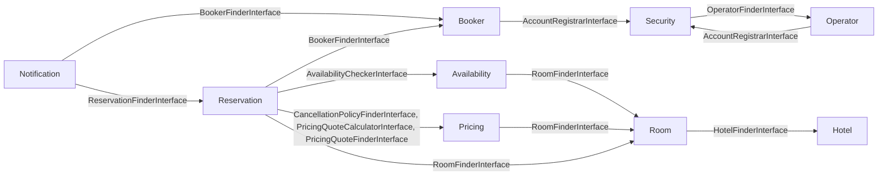

# Context Map

> Generated — do not edit manually. Run: `make contextmap`

```mermaid
graph LR
  Availability -->|RoomFinderInterface| Room
  Booker -->|AccountRegistrarInterface| Security
  Notification -->|BookerFinderInterface| Booker
  Notification -->|ReservationFinderInterface| Reservation
  Operator -->|AccountRegistrarInterface| Security
  Pricing -->|RoomFinderInterface| Room
  Reservation -->|AvailabilityCheckerInterface| Availability
  Reservation -->|BookerFinderInterface| Booker
  Reservation -->|CancellationPolicyFinderInterface, PricingQuoteCalculatorInterface, PricingQuoteFinderInterface| Pricing
  Reservation -->|RoomFinderInterface| Room
  Room -->|HotelFinderInterface| Hotel
  Security -->|OperatorFinderInterface| Operator
```
