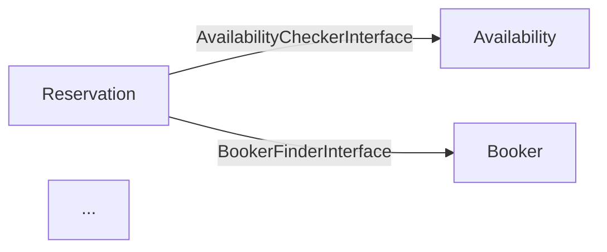

# Context Map Generator — Design Spec

**Date:** 2026-06-12
**Branch:** feat/contextmap-generator
**Status:** approved

## Goal

Automate the documentation of Published Language / Open Host Service relationships between bounded contexts. Produce a machine-readable `contextmap.yaml` and a visual `docs/context-map.md` (Mermaid diagram) from source code, with a validation script usable in CI.

## Architecture

```
bin/
  generate-contextmap.php   — reads src/ + deptrac-contexts.yaml → writes contextmap.yaml + docs/context-map.md
  check-contextmap.php      — reads contextmap.yaml → validates against src/
contextmap.yaml             — generated, versioned
docs/context-map.md         — generated, versioned (Mermaid)
```

Both scripts are standalone PHP (no Symfony container dependency), using the `symfony/yaml` component already present in vendor.

## Data Sources

`generate-contextmap.php` combines two sources:

1. **Filesystem scan** — `src/*/Application/Contract/*.php` per context:
   - `*Interface.php` → Open Host Service
   - `*View.php` → Published Language (DTO)
   - Other files (e.g. exceptions) → ignored

2. **`deptrac-contexts.yaml` ruleset** — for each context, entries ending in `Contract` identify consumed contexts. Example: `Reservation` lists `AvailabilityContract, BookerContract, PricingContract, RoomContract` → Reservation consumes those four contexts.

## Output Format

### `contextmap.yaml`

```yaml
# Generated — do not edit manually. Run: make contextmap
version: "1.0"
generated_at: "2026-06-12T..."
contexts:
  Booker:
    open_host_services:
      interfaces:
        - App\Booker\Application\Contract\BookerFinderInterface
      published_language:
        - App\Booker\Application\Contract\BookerView
    consumed_by: [Notification, Reservation]
  Pricing:
    open_host_services:
      interfaces:
        - App\Pricing\Application\Contract\PricingQuoteCalculatorInterface
        - App\Pricing\Application\Contract\PricingQuoteFinderInterface
        - App\Pricing\Application\Contract\CancellationPolicyFinderInterface
      published_language:
        - App\Pricing\Application\Contract\PricingQuoteView
        - App\Pricing\Application\Contract\CancellationPolicyView
    consumed_by: [Reservation]
  Reservation:
    open_host_services:
      interfaces: []
      published_language: []
    consumed_by: []
    consumes:
      - context: Availability
      - context: Booker
      - context: Pricing
      - context: Room
```

Rules:
- `interfaces` = all `*Interface.php` files in `Application/Contract/`
- `published_language` = all `*View.php` files in `Application/Contract/`
- `consumed_by` = derived from deptrac ruleset (inverse of `consumes`)
- `consumes` = contexts whose `*Contract` layer appears in this context's deptrac ruleset
- A context without contracts appears with empty lists.

### `docs/context-map.md`

```markdown
# Context Map

> Generated — do not edit manually. Run: `make contextmap`


```

The edge label uses the short interface name (without namespace) for readability.

## Validation (`check-contextmap.php`)

Three checks, non-zero exit on any failure (CI-safe):

1. **Classes exist** — for every `interface:` and `published_language:` in `contextmap.yaml`, the corresponding `.php` file must exist under `src/`.
2. **Consumer consistency** — cross-reference `consumed_by` lists against `deptrac-contexts.yaml` ruleset; any mismatch (declared but not in deptrac, or in deptrac but not declared) is an error.
3. **Adapters present** — for each `consumes` entry, at least one file in `src/{Consumer}/Infrastructure/` must implement the declared interface (detected via `grep` on `implements` or `use` of the interface short name).

Output format:
```
[OK]   Booker.BookerFinderInterface — class exists
[OK]   Reservation consumes Booker — adapter found
[FAIL] Foo.BarInterface — src/Foo/Application/Contract/BarInterface.php not found
```

## Makefile Targets

```makefile
contextmap: ## Generate contextmap.yaml and docs/context-map.md from source
    $(DOCKER_COMPOSE_RUN) --no-deps php php bin/generate-contextmap.php

contextmap-check: ## Validate contextmap.yaml against source code
    $(DOCKER_COMPOSE_RUN) --no-deps php php bin/check-contextmap.php
```

Both targets use `--no-deps` (no DB or broker needed).

## Out of Scope

- No auto-discovery of Domain\Port adapters (Infrastructure/Service adapters found by grep is sufficient)
- No HTML/SVG diagram output (Mermaid in markdown is sufficient)
- No watch mode / incremental regeneration
